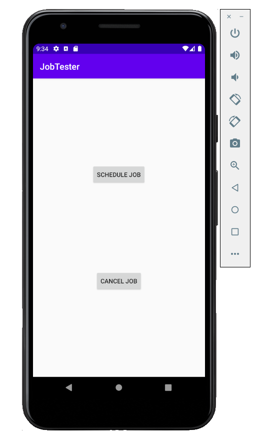

# Android Job Tester



Sample application which uses [JobScheduler](https://developer.android.com/reference/kotlin/android/app/job/JobScheduler) to schedule a [JobInfo](https://developer.android.com/reference/kotlin/android/app/job/JobInfo) using the [JOB_SCHEDULER_SERVICE](https://developer.android.com/reference/kotlin/android/content/Context.html#JOB_SCHEDULER_SERVICE:kotlin.String) to execute a [JobService](https://developer.android.com/reference/kotlin/android/app/job/JobService) on a [concurrent thread](https://kotlinlang.org/api/latest/jvm/stdlib/kotlin.concurrent/thread.html).

## Logcat Output

* Click **Schedule Job** button:

```
2020-11-05 08:28:51.730 4218-4218/com.example.jobtester D/MainActivity: scheduleJob: begin
2020-11-05 08:28:51.733 4218-4218/com.example.jobtester D/MainActivity: scheduleJob: 1
2020-11-05 08:28:51.752 4218-4218/com.example.jobtester D/BackgroundJobService: onStartJob
2020-11-05 08:28:51.756 4218-4273/com.example.jobtester D/BackgroundJobService$doBackgroundWork: doBackgroundWork: 0
2020-11-05 08:28:52.757 4218-4273/com.example.jobtester D/BackgroundJobService$doBackgroundWork: doBackgroundWork: 1
2020-11-05 08:28:53.761 4218-4273/com.example.jobtester D/BackgroundJobService$doBackgroundWork: doBackgroundWork: 2
2020-11-05 08:28:54.763 4218-4273/com.example.jobtester D/BackgroundJobService$doBackgroundWork: doBackgroundWork: 3
2020-11-05 08:28:55.767 4218-4273/com.example.jobtester D/BackgroundJobService$doBackgroundWork: doBackgroundWork: 4
2020-11-05 08:28:56.771 4218-4273/com.example.jobtester D/BackgroundJobService$doBackgroundWork: doBackgroundWork: 5
2020-11-05 08:28:57.774 4218-4273/com.example.jobtester D/BackgroundJobService$doBackgroundWork: doBackgroundWork: 6
2020-11-05 08:28:58.777 4218-4273/com.example.jobtester D/BackgroundJobService$doBackgroundWork: doBackgroundWork: 7
2020-11-05 08:28:59.780 4218-4273/com.example.jobtester D/BackgroundJobService$doBackgroundWork: doBackgroundWork: 8
2020-11-05 08:29:00.783 4218-4273/com.example.jobtester D/BackgroundJobService$doBackgroundWork: doBackgroundWork: 9
2020-11-05 08:29:01.786 4218-4273/com.example.jobtester D/BackgroundJobService$doBackgroundWork: doBackgroundWork: finished
```

* Click **Schedule Job** button, then click **Cancel Job** button:

```
2020-11-05 08:29:19.128 4218-4218/com.example.jobtester D/MainActivity: scheduleJob: begin
2020-11-05 08:29:19.133 4218-4218/com.example.jobtester D/MainActivity: scheduleJob: 1
2020-11-05 08:29:19.153 4218-4218/com.example.jobtester D/BackgroundJobService: onStartJob
2020-11-05 08:29:19.157 4218-4281/com.example.jobtester D/BackgroundJobService$doBackgroundWork: doBackgroundWork: 0
2020-11-05 08:29:20.159 4218-4281/com.example.jobtester D/BackgroundJobService$doBackgroundWork: doBackgroundWork: 1
2020-11-05 08:29:21.161 4218-4281/com.example.jobtester D/BackgroundJobService$doBackgroundWork: doBackgroundWork: 2
2020-11-05 08:29:21.628 4218-4218/com.example.jobtester D/MainActivity: cancelJob: begin
2020-11-05 08:29:21.630 4218-4218/com.example.jobtester D/MainActivity: cancelJob: end
2020-11-05 08:29:21.635 4218-4218/com.example.jobtester D/BackgroundJobService: onStopJob
2020-11-05 08:29:22.163 4218-4281/com.example.jobtester D/BackgroundJobService$doBackgroundWork: doBackgroundWork: 3
2020-11-05 08:29:22.164 4218-4281/com.example.jobtester D/BackgroundJobService$doBackgroundWork: doBackgroundWork: finished
```
